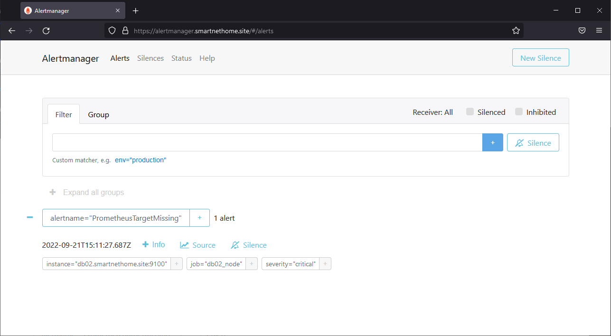

# Дипломный практикум в YandexCloud 

### Заметаев Алексей Александрович

### 2022 год B;tdcr

1. [Репозиторий со всеми Terraform манифестами](terraform) и готовность продемонстрировать создание всех ресурсов с нуля.

2. [Репозиторий со всеми Ansible ролями](ansible) и готовность продемонстрировать установку всех сервисов с нуля.

3. Скриншоты веб-интерфейсов всех сервисов работающих по HTTPS на моем доменном имени.

Регистрация домена, доступ к управлению записями.  


 Полученная конфигурация инфраструктуры  


Установлены сертификаты   


### Установка кластера MySQL


### Установка WordPress


---
### Установка Gitlab CE и Gitlab Runner


Проведена настройка через GUI.

```commandline
stages:
  - deploy
deploy-job:
  stage: deploy
  script:
    - if [ "$CI_COMMIT_TAG" = "" ] ; then echo "Need add tag!";
      else 
        scp -q -o StrictHostKeyChecking=no -r $CI_PROJECT_DIR/* runner@app.smartnethome.site:/var/www/smartnethome.site/;
      fi
    - echo "The End"
```


Просмотр Wordpress после коммита с тэгом.  


### Интерфейсы Prometheus, Alert Manager и Grafana доступены по https.


При отключении одной из нод экран Alert Manage


### Что необходимо для сдачи задания?

1. Репозиторий со всеми Terraform манифестами и готовность продемонстрировать создание всех ресурсов с нуля.
2. Репозиторий со всеми Ansible ролями и готовность продемонстрировать установку всех сервисов с нуля.
3. Скриншоты веб-интерфейсов всех сервисов работающих по HTTPS на вашем доменном имени.
  - `https://www.you.domain` (WordPress)
  - `https://gitlab.you.domain` (Gitlab)
  - `https://grafana.you.domain` (Grafana)
  - `https://prometheus.you.domain` (Prometheus)
  - `https://alertmanager.you.domain` (Alert Manager)
4. Все репозитории рекомендуется хранить на одном из ресурсов ([github.com](https://github.com) или [gitlab.com](https://gitlab.com)).


```commandline
Версии ПО
$terraform -v
Terraform v1.2.9
on linux_amd64
+ provider registry.terraform.io/yandex-cloud/yandex v0.78.2

$ansible --version
ansible 2.9.6
  config file = /home/vagrant/a/ansible.cfg
  configured module search path = ['/home/vagrant/.ansible/plugins/modules', '/usr/share/ansible/plugins/modules']
  ansible python module location = /usr/lib/python3/dist-packages/ansible
  executable location = /usr/bin/ansible
  python version = 3.8.10 (default, Jun 22 2022, 20:18:18) [GCC 9.4.0]


Имеются дополнительные возможности атоматизации процесса, запуск из террформа ansible, что очень подробно выложено в лекции, но для лучшего контроля и понимания делалось по частям.

Сенарий выполнения.
В каталоге с террафором

terraform workspace new stage
terraform workspace select stage
terraform plan
terraform apply

Из каталога с Ansible
ansible-playbook front.yml 
ansible-playbook mydbcluster.yml
ansible-playbook wordpress.yml
ansible-playbook gitlab.yml
(в конце скрипта выведется токен для runner его ввести в скрипт runner)
ansible-playbook runner.yml
ansible-playbook node_exporter.yml
ansible-playbook monitoring.yml (загрузить формы templates_grafana)

```
 
